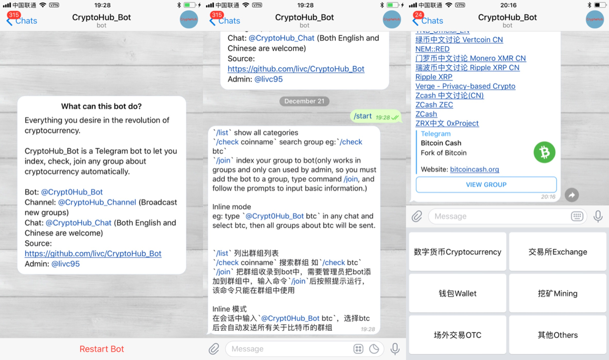
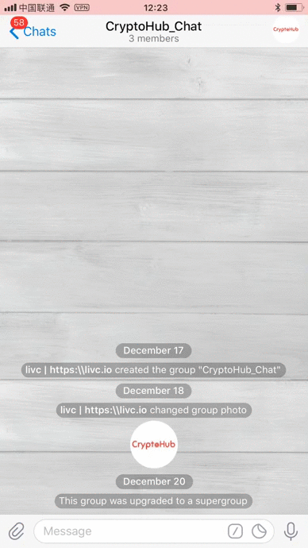

    

**CryptoHub_Bot** is a Telegram bot to let you index, check, join any group about cryptocurrency automatically.

## Bot

`/start` start

`/list`  show all categories, we have categories about cryptocurrency, exchange, wallet, mining, OTC, and other related topics.

`/check coinname` search group, eg: `/check btc`

`/join` index your group to the Bot(only works in groups and only can used by **admin**, so you must add the bot to a group, type command `/join`, and follow the prompts to input basic information.) After that the group information will be sent to channel automatically.

`/delete` remove your group from bot.

## Inline Mode

eg: type `@Crypt0Hub_Bot btc` in any chat and select `btc`, then all groups about `btc` will be sent.

## Build your own

1. Install `mongodb`
2. `copy config.json config_user.json` and type your settings in `config_user.json`
3. `python3 main.py`

## Acknowledgement

This work is inspired by [GroupHub_bot](https://github.com/livc/GroupHub_Bot)(my project)[DEPRECATED], [osiris-groupindexer](https://github.com/wfjsw/osiris-groupindexer), [Telegram 中文群组列表机器人](https://github.com/jqs7/Jqs7Bot)[DEPRECATED].

## Donate(BTC)

1DTsgjsbGNx7Fx1sZTSGAXeiht57efrmz4
